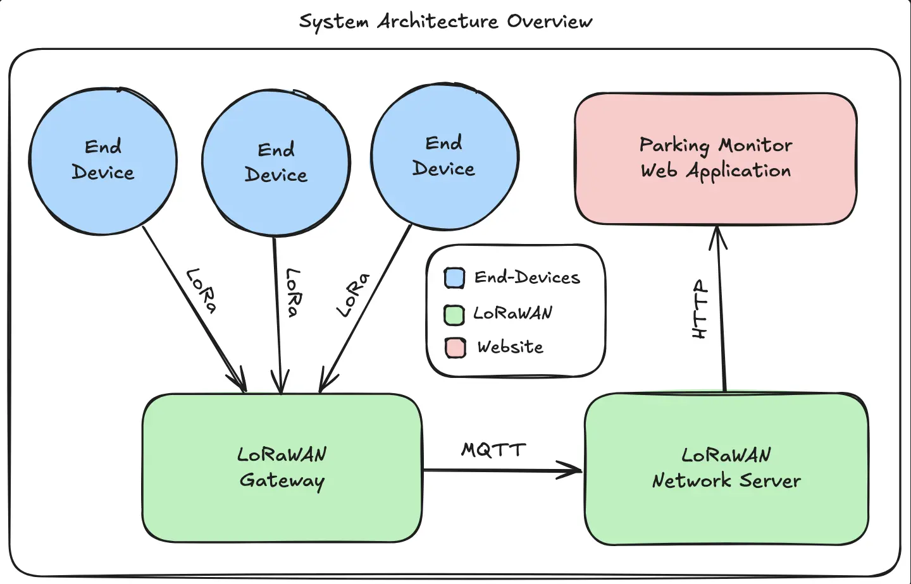

## Overview

Parking on campus has become an ongoing challenge as rising vehicle demand
and limited availability leave students, faculty, and visitors increasingly frustrated. To address
this, our group designed a scalable, cost-effective, and low-maintenance system to monitor
real-time parking availability.

The system leverages custom IoT sensors to detect vehicle presence, transmitting the data via a
LoRaWAN network and presenting it through an intuitive web application. By providing accurate,
real-time updates on available spaces, this solution helps users save time and minimize the stress
of searching for parking on a crowded campus.

*Work in progress...*
